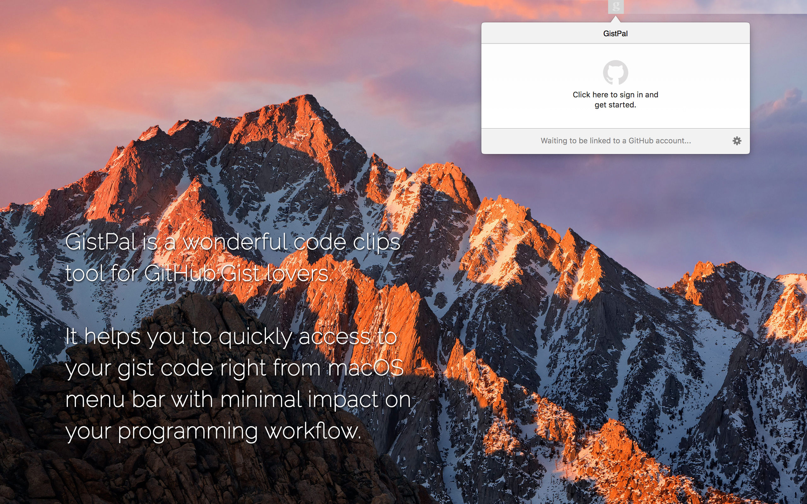
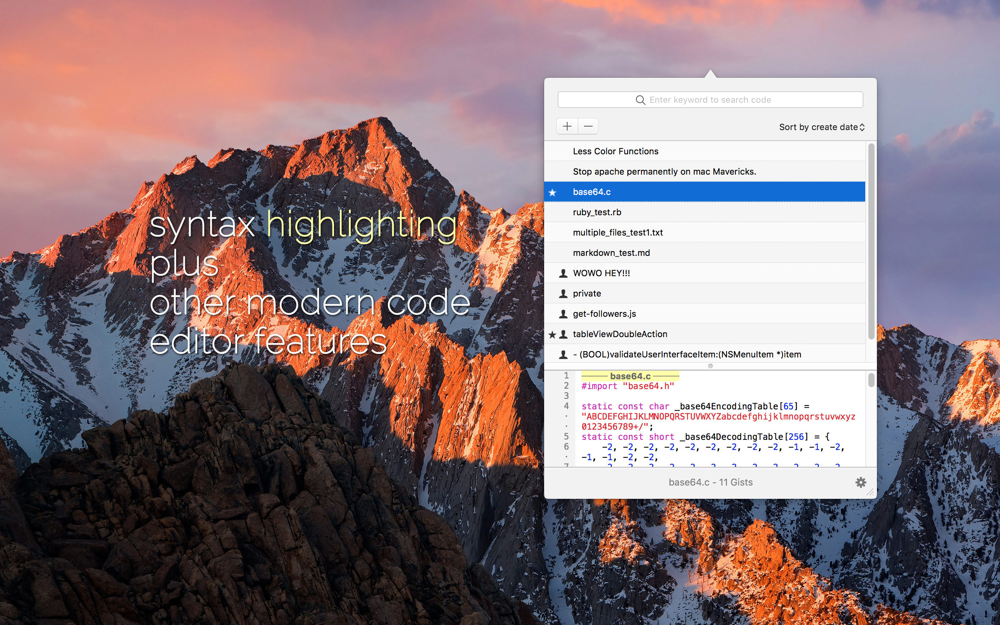
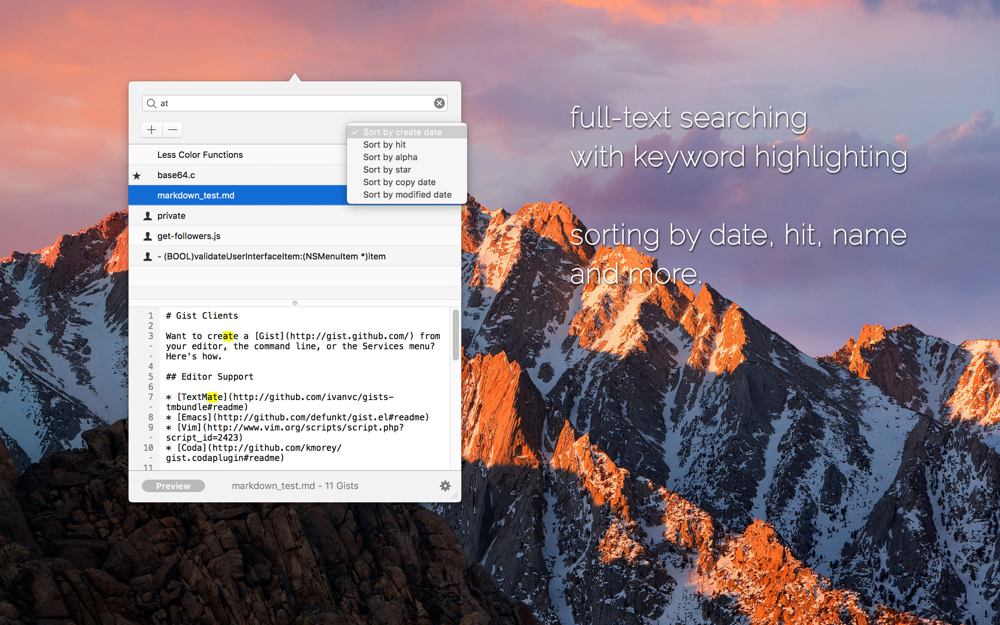
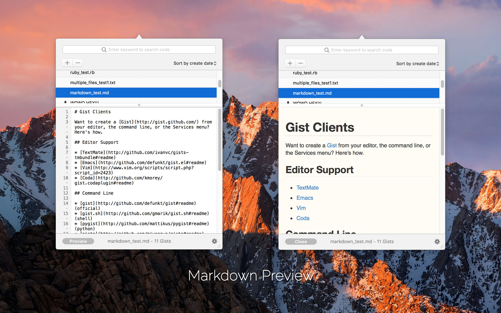

# GistPal for Mac

GistPal is a wonderful code clips tool for GitHub:Gist lovers. It helps you to quickly access to your gist code from macOS menu bar.

**Update for macOS High Sierra**

FEATURES: 

* Full-text search
* Syntax highlight、line number
* Markdown preview
* Sorting by your copy frequency
* Multiple files in one view
* Instant editing and saving in popup panel
* Auto and manually sync

GistPal means to provide a code clips tool with minimal impact on your programming workflow.

# Screenshots

# Apple App Store Link

https://itunes.apple.com/ca/app/gistpal/id602550970?mt=12
